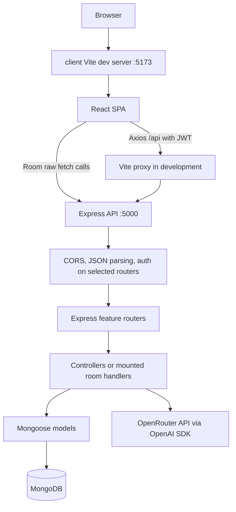
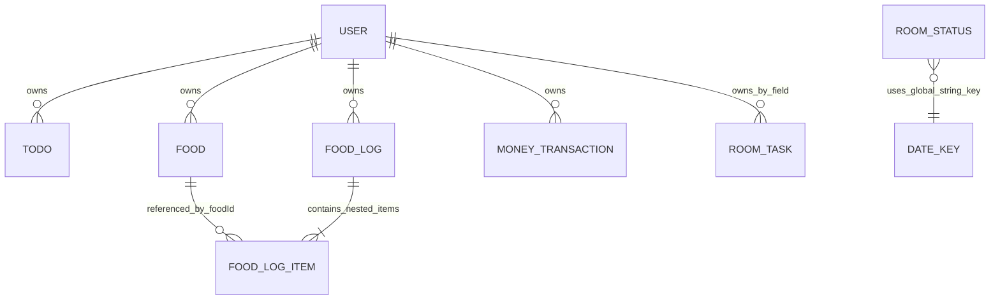
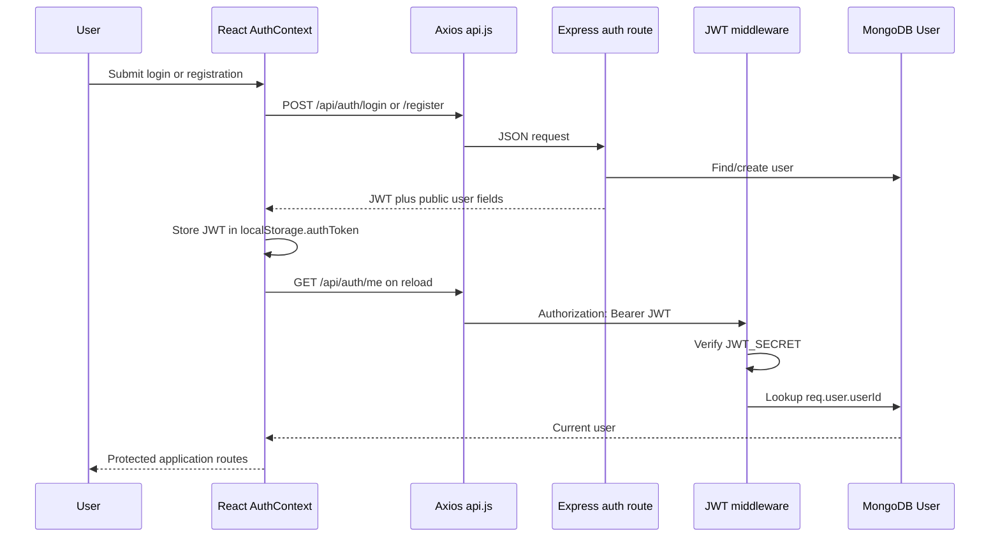
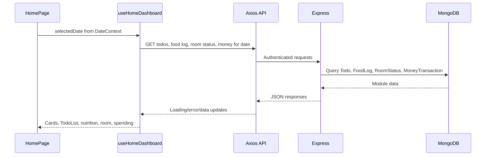

# Project Architecture

> This document describes the repository as implemented in the source tree at the time of writing. It is the architecture reference for developers and coding agents. Planned behavior in `plan.txt` and phase notes is labeled as planned; it is not treated as implemented behavior.

## 1. Project Overview

### Identity and purpose

**Project:** IkiGai Life OS

IkiGai is a personal daily-life dashboard. It combines a date-centered home screen with four modules:

- Home: aggregates tasks, food, room status, and spending for one selected date.
- Food: records meals and nutrition snapshots, with AI-assisted natural-language parsing.
- Room: records daily room/environment checks and recurring room tasks.
- Money: records spending transactions and calculates daily and monthly totals.

The application targets an authenticated individual user. The backend is intended to isolate most data by the authenticated user's MongoDB `User` id.

### Technology stack

- Frontend: React 19, React DOM, React Router DOM 7, Axios, Vite, JSX, CSS.
- Backend: Node.js/CommonJS, Express 5, CORS, `dotenv`, JSON Web Tokens, `bcryptjs`.
- Persistence: MongoDB through Mongoose 9.
- AI integration: OpenAI SDK configured for the OpenRouter-compatible API.
- Development tooling: Vite, `@vitejs/plugin-react`, Oxlint, Nodemon.
- Tests: no implemented test suite; the server test script is a deliberate failing placeholder.

### Architectural pattern

The implemented system is a two-process client/server application:

1. Vite serves the React single-page application.
2. React routes render pages and components.
3. Frontend service modules call the Express API.
4. Express mounts feature routers.
5. Most routers apply JWT middleware and controllers query Mongoose models.
6. MongoDB stores user-owned documents.
7. The AI food parser is a backend integration boundary to OpenRouter.

The backend does not have a separate repository or domain-service layer for todos, food, food logs, money, or room. Controllers perform request validation, business logic, and Mongoose access directly. `server/services/` contains only health and AI parsing services.

## 2. High-Level Architecture



Runtime entry points:

- Browser entry: `client/index.html` -> `client/src/main.jsx` -> `client/src/App.jsx`.
- Node entry: `server/server.js` -> `server/app.js`.
- Database initialization: `server/app.js` calls `connectDB()` from `server/config/db.js`.

## 3. Complete Project Structure

```text
IkiGai/
|-- PROJECT_ARCHITECTURE.md
|-- package-lock.json
|-- .gitignore
|-- .vscode/settings.json
|-- plan.txt
|-- AUTH_IMPLEMENTATION_SUMMARY.md
|-- PHASE3_AUTHENTICATION.md
|-- QUICK_START_AUTH.md
|-- SETUP_MONGODB_PHASE2.md
|-- client/
|   |-- package.json
|   |-- package-lock.json
|   |-- index.html
|   |-- vite.config.js
|   |-- README.md
|   |-- .env.example
|   |-- public/
|   |-- src/
|       |-- main.jsx
|       |-- App.jsx
|       |-- App.css
|       |-- index.css
|       |-- assets/
|       |-- components/
|       |   |-- Layout.jsx
|       |   |-- Sidebar.jsx
|       |   |-- HomeCalendar.jsx
|       |   |-- TodoList.jsx
|       |   |-- QuickSummary.jsx
|       |-- context/
|       |   |-- AuthContext.jsx
|       |   |-- AppContext.jsx
|       |   |-- DateContext.jsx
|       |-- hooks/
|       |   |-- useHealthCheck.js
|       |   |-- useHomeDashboard.js
|       |-- pages/
|       |   |-- HomePage.jsx
|       |   |-- LoginPage.jsx
|       |   |-- RegisterPage.jsx
|       |   |-- FoodPage.jsx
|       |   |-- RoomPage.jsx
|       |   |-- MoneyPage.jsx
|       |   |-- NotFoundPage.jsx
|       |-- services/
|       |   |-- api.js
|       |   |-- todoService.js
|       |   |-- foodService.js
|       |   |-- roomService.js
|       |   |-- moneyService.js
|       |-- utils/
|           |-- format.js
|-- server/
    |-- package.json
    |-- package-lock.json
    |-- .env.example
    |-- .gitignore
    |-- server.js
    |-- app.js
    |-- config/
    |   |-- db.js
    |-- controllers/
    |   |-- authController.js
    |   |-- todoController.js
    |   |-- foodController.js
    |   |-- foodLogController.js
    |   |-- moneyController.js
    |   |-- aiController.js
    |   |-- healthController.js
    |-- middleware/
    |   |-- auth.js
    |   |-- errorHandler.js
    |-- models/
    |   |-- User.js
    |   |-- Todo.js
    |   |-- Food.js
    |   |-- FoodLog.js
    |   |-- MoneyTransaction.js
    |   |-- RoomTask.js
    |   |-- RoomStatus.js
    |   |-- RoomLog.js
    |   |-- HealthCheck.js
    |-- routes/
    |   |-- authRoutes.js
    |   |-- healthRoutes.js
    |   |-- todoRoutes.js
    |   |-- foodRoutes.js
    |   |-- foodLogRoutes.js
    |   |-- moneyRoutes.js
    |   |-- aiRoutes.js
    |   |-- room.js
    |   |-- roomRoutes.js
    |-- services/
        |-- healthService.js
        |-- aiFoodParser.js
```

### Root files and folders

| Path | Purpose and responsibilities | Depends on / used by | Exports or side effects |
| --- | --- | --- | --- |
| `package-lock.json` | Root npm lockfile. No root `package.json` is present in the inspected tree, so the owning root dependency contract is unclear. | Repository tooling | Lockfile metadata only. |
| `.gitignore` | Ignores Node modules, client build output, and environment files while allowing `.env.example`. | Git | No runtime side effects. |
| `.vscode/settings.json` | Workspace editor settings. | VS Code | Editor-only side effects. |
| `plan.txt` | Product/implementation planning notes, including money, dashboard, UI, and testing phases. | Humans/agents | Not imported by runtime. |
| `AUTH_IMPLEMENTATION_SUMMARY.md`, `PHASE3_AUTHENTICATION.md`, `QUICK_START_AUTH.md` | Authentication setup and phase documentation. | Humans/agents | Not imported by runtime. `QUICK_START_AUTH.md` contains credential material and should be treated as sensitive. |
| `SETUP_MONGODB_PHASE2.md` | MongoDB setup notes. | Humans/agents | Not imported by runtime. |
| `client/` | React/Vite application. | Browser | Builds `client/dist` when built. |
| `server/` | Express/Mongoose API application. | Node.js, MongoDB, OpenRouter for AI calls | Starts an HTTP server. |

### Frontend files

#### Build and entry files

| Path | Purpose | Depends on | Used by / side effects |
| --- | --- | --- | --- |
| `client/index.html` | Vite HTML shell containing the root element. | Vite | Loads `client/src/main.jsx`. |
| `client/src/main.jsx` | React entry point. Imports global CSS, creates the root, and renders `App` in `StrictMode`. | React DOM, `App.jsx`, `index.css` | Loaded by `index.html`; mounts the SPA. |
| `client/src/App.jsx` | Application composition and routing. Declares `ProtectedRoute`, `AuthRoute`, `AppShell`, providers, route table, and health indicator. | React Router, contexts, pages, `Layout`, `useHealthCheck`, formatting utility, CSS | Root component used by `main.jsx`. Runs health polling once through `useHealthCheck` on the shell. |
| `client/vite.config.js` | Vite React plugin and dev server configuration. Dev server binds `0.0.0.0:5173` and proxies `/api` to `http://localhost:5000`. | Vite, React plugin | Used by Vite scripts. |
| `client/package.json` | Frontend scripts and dependency contract. | npm | `dev`, `build`, `lint`, and `preview`. |
| `client/.env.example` | Documents `VITE_API_URL`. | Vite environment loading | Reference only. |
| `client/src/App.css`, `client/src/index.css` | Application and global styling. | Browser CSS | Imported by `App.jsx` and `main.jsx`. |
| `client/public/` | Static public assets, if any. | Vite | Served without import processing. |
| `client/src/assets/` | Imported frontend assets, if any. | Vite | Asset dependencies; no additional architectural behavior was identified. |

#### Providers, state, and hooks

| Path | State or behavior | Consumers |
| --- | --- | --- |
| `client/src/context/AuthContext.jsx` | Owns `user`, JWT token, loading state, error state, register/login/logout, and initial `/auth/me` verification. Persists the token in `localStorage` key `authToken`. | `App.jsx`, `Sidebar.jsx`, `HomePage.jsx`, login/register pages. |
| `client/src/context/AppContext.jsx` | Owns global API health status, initially `{ status: 'checking' }`. | `App.jsx`, `useHealthCheck.js`. |
| `client/src/context/DateContext.jsx` | Owns the selected local calendar date as `YYYY-MM-DD`. | Home, food, room, money pages, calendar. |
| `client/src/hooks/useHealthCheck.js` | Calls `getHealthStatus()` on mount and writes success/error to `AppContext`. | `AppShell` in `App.jsx`. |
| `client/src/hooks/useHomeDashboard.js` | Fetches todos, food log, room status, and money for one date. Exposes loading/error/data state and `refreshTodos`. Also computes fallback nutrition totals and meal item counts. | `HomePage.jsx`. |

#### Components and pages

| Path | Purpose, dependencies, and relationships |
| --- | --- |
| `client/src/components/Layout.jsx` | Shared authenticated shell: `Sidebar` plus main content. Used by `AppShell`. |
| `client/src/components/Sidebar.jsx` | Main navigation for Home, Food, Room, and Money; displays authenticated user and performs logout. Uses React Router and `AuthContext`. |
| `client/src/components/HomeCalendar.jsx` | Month calendar. Reads/writes `DateContext`; selecting a cell changes the date consumed by each module. |
| `client/src/components/TodoList.jsx` | Date-specific task UI. Calls `todoService` for create/update/delete/complete and asks `HomePage` to refresh. |
| `client/src/components/QuickSummary.jsx` | Present in the tree but not imported by the current application path. Treat as unused until a caller is added. |
| `client/src/pages/HomePage.jsx` | Dashboard page. Calls `useHomeDashboard`, renders `TodoList`, nutrition summary, room summary, spending summary, and `HomeCalendar`; navigates to feature pages. |
| `client/src/pages/LoginPage.jsx` | Login form. Uses `AuthContext.login`, navigates after success, and preserves a requested route through router location state. |
| `client/src/pages/RegisterPage.jsx` | Registration form. Uses `AuthContext.register` and navigation. |
| `client/src/pages/FoodPage.jsx` | Date-specific food log UI. Loads logs, requests AI parsing, confirms one or more nutrition items through `foodService`, and edits/deletes meal items. |
| `client/src/pages/RoomPage.jsx` | Room status and room-task UI. Uses raw `fetch` for all room reads/writes, independent of the shared Axios interceptor. |
| `client/src/pages/MoneyPage.jsx` | Date-specific transaction CRUD UI, day navigation, calendar, daily total, and monthly total. Uses `moneyService`. |
| `client/src/pages/NotFoundPage.jsx` | Not-found UI and navigation. |
| `client/src/utils/format.js` | Shared display formatting, including health status text. |

## 4. Frontend Architecture

### Routing

`client/src/App.jsx` creates a `BrowserRouter` and renders:

- Public/auth routes: `/login`, `/register`.
- Protected routes: `/`, `/home`, `/food`, `/room`, `/money`.
- `/not-found` is rendered by the authenticated route table.
- Unauthenticated unknown paths redirect to `/login`.
- Authenticated unknown paths redirect to `/not-found`.
- `/home` is an alias for `/`.

Provider order is significant:

```text
BrowserRouter
  AuthProvider
    AppProvider
      DateProvider
        AppShell
          Layout (authenticated only)
            page route
```

### State flow

There is no Redux, Zustand, React Query, or other global store. State is split into:

- Auth state: `AuthContext` and browser `localStorage`.
- Health state: `AppContext`.
- Selected date: `DateContext`.
- Dashboard server state: local state inside `useHomeDashboard`.
- Form and page state: local `useState` in each page/component.

The common feature path is:

```text
Page/component
  -> context or local event handler
  -> service module (Axios) or raw fetch (RoomPage)
  -> Express endpoint
  -> JSON response
  -> local state/context update
  -> rerender
```

### Frontend service map

| File | Functions and endpoint calls |
| --- | --- |
| `client/src/services/api.js` | Axios base URL is `VITE_API_URL` or `http://localhost:5000/api`; request interceptor reads `authToken` and adds `Authorization: Bearer ...`; response interceptor clears token and redirects to `/login` on HTTP 401. |
| `client/src/services/todoService.js` | `getTodosByDate` -> `GET /todos?date=...`; `createTodo` -> `POST /todos`; `updateTodo` -> `PUT /todos/:id`; `deleteTodo` -> `DELETE /todos/:id`. |
| `client/src/services/foodService.js` | Food master search/create/update/delete; date log read; add/update/delete meal item; `analyzeFood` -> `POST /ai/food-parser` with a 60-second timeout. |
| `client/src/services/roomService.js` | `getRoomStatusByDate` -> `GET /room/status/:date`. Used by the home dashboard, so it uses Axios and the JWT interceptor. It does not implement room task operations. |
| `client/src/services/moneyService.js` | `getTransactionsByDate` -> `GET /money?date=...`; create/update/delete transaction operations. |

### Frontend dependency relationship

```text
App.jsx
  -> AuthContext, AppContext, DateContext
  -> pages and Layout
HomePage.jsx
  -> useHomeDashboard
    -> todoService -> /api/todos -> todoController -> Todo
    -> foodService -> /api/food-logs/date/:date -> foodLogController -> FoodLog
    -> roomService -> /api/room/status/:date -> room.js -> RoomStatus
    -> moneyService -> /api/money?date=... -> moneyController -> MoneyTransaction
Feature pages
  -> feature service -> shared api.js -> Express router -> controller/model
```

## 5. Backend Architecture

### Startup and middleware lifecycle

```mermaid
flowchart TD
    Server[server/server.js] --> App[server/app.js]
    App --> Dotenv[dotenv.config]
    App --> Cors[CORS allowlist with credentials]
    App --> Body[express.json + urlencoded]
    App --> DB[connectDB]
    App --> Mount[Mount routers]
    Request[HTTP request] --> Cors
    Cors --> Body
    Body --> Auth{Router auth middleware?}
    Auth -->|yes| JWT[auth.js verifies Bearer JWT]
    Auth -->|no| Handler[route handler]
    JWT --> Handler
    Handler --> Controller[controller or inline room handler]
    Controller --> Model[Mongoose model]
    Model --> Mongo[(MongoDB)]
    Controller --> Response[JSON response]
    Handler --> NotFound[404 fallback]
    Controller --> Error[errorHandler when next(error)]
```

`server/app.js` configures CORS, parsers, database connection, root response, route mounts, a JSON 404 response, and the final error handler. `server/server.js` calls `listen` using `PORT` or `5000`.

Important runtime detail: `connectDB()` is called without awaiting it. The HTTP listener can start while MongoDB connection is pending or unavailable. When `MONGODB_URI` is absent, `connectDB` warns and returns rather than stopping the process.

### Backend file responsibilities

| Path | Purpose and relationships |
| --- | --- |
| `server/app.js` | Express composition root. Mounts `/api/health`, `/api/auth`, `/api/todos`, `/api/foods`, `/api/food-logs`, `/api/room`, `/api/money`, and `/api/ai`. It imports `room.js`, not `roomRoutes.js`. |
| `server/server.js` | Process entry and HTTP listener. |
| `server/config/db.js` | Reads `MONGODB_URI`; connects Mongoose with IPv4, server selection, and socket timeouts; logs connection failures. |
| `server/middleware/auth.js` | Reads the Bearer token, verifies it with `JWT_SECRET`, attaches `{ userId }` to `req.user`, and returns 401 for absent/invalid/expired tokens. |
| `server/middleware/errorHandler.js` | Converts Mongoose validation, duplicate-key, cast, JWT, custom-status, and generic errors into JSON responses. Includes stack traces outside production. |
| `server/controllers/authController.js` | Registration, login, token generation, password hashing, and current-user lookup. |
| `server/controllers/todoController.js` | Date normalization, user-scoped todo CRUD, priority validation, and completion totals. |
| `server/controllers/foodController.js` | User-scoped food master CRUD and case-insensitive search. |
| `server/controllers/foodLogController.js` | Food log CRUD, nested meal-item operations, nutrition snapshot creation, and daily total recalculation. |
| `server/controllers/moneyController.js` | User-scoped transaction CRUD, positive amount validation, daily totals, and monthly aggregate. |
| `server/controllers/aiController.js` | Validates food text and delegates to `parseFoodText`. |
| `server/controllers/healthController.js` | Returns a static health payload with `status: 'OK'`, message, and timestamp. |
| `server/services/healthService.js` | Exists and returns the same health-shaped object, but the current health controller does not import it. |
| `server/services/aiFoodParser.js` | Configures OpenRouter through the OpenAI SDK; asks the model for structured nutrition; contains whitelist-based protein post-processing. |
| `server/routes/room.js` | Mounted live room implementation with inline async handlers and direct Mongoose access. It has no `auth` middleware. |
| `server/routes/roomRoutes.js` | Unmounted alternative route module. It applies auth but every declared handler returns HTTP 501. It is dead/unreachable from current `app.js`. |

## 6. API Documentation

All paths below include the `/api` prefix used by `server/app.js`. Unless stated otherwise, success and error responses are JSON. Controllers generally call `next(error)` so the centralized error handler formats uncaught errors.

### Root and health

| Method | Endpoint | Auth | Handler and persistence |
| --- | --- | --- | --- |
| `GET` | `/` | No | Inline handler in `server/app.js`; returns `{ message: 'Welcome to IkiGai API' }`; no database. |
| `GET` | `/api/health` | No | `healthRoutes.js` -> `healthController.js`; static `{ status: 'OK', message, timestamp }`; no database. |

### Authentication

| Method | Endpoint | Auth | Body | Success | Errors |
| --- | --- | --- | --- | --- | --- |
| `POST` | `/api/auth/register` | No | `email`, `password`, `name` | 201; `{ success, message, token, user }` | 400 missing fields; 409 existing email; validation/500 through handler. |
| `POST` | `/api/auth/login` | No | `email`, `password` | 200; `{ success, message, token, user }` | 400 missing fields; 401 invalid credentials. |
| `GET` | `/api/auth/me` | Bearer JWT | No body | 200; `{ success, user }` | 401 missing/invalid/expired token; 404 missing user. |

Frontend callers: `AuthContext.jsx` calls these through `services/api.js`. The token is stored under `localStorage.authToken` and automatically added by the Axios request interceptor.

### Todos

Router: `server/routes/todoRoutes.js` applies `auth` to every route. Controller: `server/controllers/todoController.js`. Database: `Todo` collection, always filtered by `req.user.userId`.

| Method | Endpoint | Body/query | Behavior |
| --- | --- | --- | --- |
| `GET` | `/api/todos?date=YYYY-MM-DD` | Required `date` query | Returns `todos`, `total`, `completed`, `remaining`, and normalized date. Filters due date using UTC day bounds. |
| `POST` | `/api/todos` | `title`, `dueDate`; optional `description`, `completed`, `priority` | Creates a todo; returns 201 `{ success, todo }`. Priority is `low`, `medium`, or `high`; missing priority defaults to medium. |
| `PUT` | `/api/todos/:id` | Any supported mutable fields | User-scoped update; returns `{ success, todo }`. |
| `DELETE` | `/api/todos/:id` | None | User-scoped deletion; returns `{ success, message }`. |

Frontend callers: `TodoList.jsx` via `todoService.js`; dashboard reads via `useHomeDashboard.js`.

### Food master records

Router: `server/routes/foodRoutes.js`, authenticated. Controller: `foodController.js`. Database: `Food` collection.

| Method | Endpoint | Body/query | Behavior |
| --- | --- | --- | --- |
| `GET` | `/api/foods?search=text` | Optional `search` | Case-insensitive name regex, user scoped, sorted by name, limited to 200. |
| `POST` | `/api/foods` | `name`, `servingSize`, `servingUnit`, `calories`, `protein`, `carbs`, `fat`, `fiber` | Creates a user-owned master food; 201. |
| `GET` | `/api/foods/:id` | Path id | User-scoped lookup; 404 if absent. |
| `PUT` | `/api/foods/:id` | Mongoose-validatable field updates | User-scoped update. |
| `DELETE` | `/api/foods/:id` | Path id | User-scoped delete. |

The current `FoodPage.jsx` primarily uses AI-generated custom food entries and does not visibly expose all master-food CRUD operations in the inspected call path.

### Food logs and meal items

Router: `server/routes/foodLogRoutes.js`, authenticated. Controller: `foodLogController.js`. Database: `FoodLog` with optional references to `Food`.

| Method | Endpoint | Body/query | Behavior |
| --- | --- | --- | --- |
| `GET` | `/api/food-logs` | None | Returns up to 50 user logs sorted newest first. |
| `POST` | `/api/food-logs` | `date`, `meals` | Creates/replaces a date log with server-recalculated totals; 201. |
| `GET` | `/api/food-logs/:id` | Path id | User-scoped log lookup. |
| `PUT` | `/api/food-logs/:id` | `meals` | Full meal update with recalculated totals. |
| `DELETE` | `/api/food-logs/:id` | Path id | Deletes a log. |
| `GET` | `/api/food-logs/date/:date` | Date path | Returns a user/date log or an in-memory empty template with `exists: false`. |
| `POST` | `/api/food-logs/:date/meals/:meal/items` | `foodId` or `description`; quantity and nutrition fields | Adds a snapshot to one of `breakfast`, `morningSnack`, `lunch`, `eveningSnack`, `dinner`; recalculates totals. |
| `PUT` | `/api/food-logs/:id/meals/:meal/items/:itemId` | `quantity` | Recomputes master-food snapshots or scales custom items. |
| `DELETE` | `/api/food-logs/:id/meals/:meal/items/:itemId` | None | Removes a nested item and recalculates totals. |

Frontend callers: `FoodPage.jsx` and `useHomeDashboard.js` through `foodService.js`.

### Money

Router: `server/routes/moneyRoutes.js`, authenticated. Controller: `moneyController.js`. Database: `MoneyTransaction`.

| Method | Endpoint | Body/query | Behavior |
| --- | --- | --- | --- |
| `GET` | `/api/money?date=YYYY-MM-DD` | Required `date` query | Returns date transactions, server-calculated daily `total`, month key, and `monthlyTotal` from an aggregation. |
| `POST` | `/api/money` | `description`, positive `amount`, `date` | Creates user-owned transaction; 201. |
| `PUT` | `/api/money/:id` | Optional `description`, `amount`, `date` | User-scoped update. |
| `DELETE` | `/api/money/:id` | Path id | User-scoped delete. |

Frontend callers: `MoneyPage.jsx` and `useHomeDashboard.js` through `moneyService.js`.

### Room

Mounted router: `server/routes/room.js`. **No `auth` middleware is applied.** The route directly queries or mutates `RoomStatus` and `RoomTask`.

| Method | Endpoint | Body | Behavior |
| --- | --- | --- | --- |
| `GET` | `/api/room/status/:date` | None | Finds a global `RoomStatus` by string date, or returns a null-valued template. |
| `PUT` | `/api/room/status/:date` | `waterAvailable`, `roomClean`, `clothesReady` | Upserts the global status by date. |
| `POST` | `/api/room/tasks` | `userId`, `title`, `description`, `dueDate`, `recurring` | Creates a `RoomTask` using the client-supplied user id. |
| `GET` | `/api/room/tasks/:date` | None | Finds all tasks due on or before date, then applies recurrence filtering in memory. Does not filter by user id. |
| `PUT` | `/api/room/tasks/:id` | `title`, `description`, `dueDate`, `recurring` | Updates by id without user ownership check. |
| `DELETE` | `/api/room/tasks/:id` | None | Deletes by id without user ownership check. |
| `PUT` | `/api/room/tasks/:id/complete` | Optional `date` for recurring task | Marks one-off task complete or appends a recurring completion date; no user ownership check. |

Frontend callers: `RoomPage.jsx` uses raw `fetch` for every room request. `useHomeDashboard.js` uses `roomService.js` only for room status.

Unreachable alternative: `server/routes/roomRoutes.js` is not mounted. Its `/logs` and `/tasks` endpoints return 501 and therefore are not live API behavior.

### AI food parser

| Method | Endpoint | Auth | Body | Handler and external call |
| --- | --- | --- | --- | --- |
| `POST` | `/api/ai/food-parser` | Bearer JWT through `aiRoutes.js` | `{ text: string }` | `aiController.parseFood` validates text then `aiFoodParser.parseFoodText` calls OpenRouter using the OpenAI SDK. Returns `{ success, items }`. |

The parser requests JSON nutrition items from model `openai/gpt-oss-20b`, supports units `g`, `ml`, `piece`, `slice`, `cup`, `tbsp`, `tsp`, and `oz`, and applies a local whitelist for protein estimates.

## 7. API Call Map

```text
client/src/context/AuthContext.jsx
  -> api.post('/auth/register') / api.post('/auth/login') / api.get('/auth/me')
  -> server/routes/authRoutes.js
  -> server/controllers/authController.js
  -> User model
  -> MongoDB

client/src/hooks/useHomeDashboard.js
  -> todoService.getTodosByDate
  -> GET /api/todos?date=...
  -> todoRoutes.js -> todoController.js -> Todo

client/src/hooks/useHomeDashboard.js
  -> foodService.getFoodLogByDate
  -> GET /api/food-logs/date/:date
  -> foodLogRoutes.js -> foodLogController.js -> FoodLog

client/src/hooks/useHomeDashboard.js
  -> roomService.getRoomStatusByDate
  -> GET /api/room/status/:date
  -> room.js inline handler -> RoomStatus

client/src/hooks/useHomeDashboard.js
  -> moneyService.getTransactionsByDate
  -> GET /api/money?date=...
  -> moneyRoutes.js -> moneyController.js -> MoneyTransaction

client/src/components/TodoList.jsx
  -> todoService create/update/delete
  -> /api/todos
  -> todoRoutes.js -> todoController.js -> Todo

client/src/pages/FoodPage.jsx
  -> foodService.analyzeFood
  -> POST /api/ai/food-parser
  -> aiRoutes.js -> aiController.js -> aiFoodParser.js -> OpenRouter

client/src/pages/FoodPage.jsx
  -> foodService.add/update/delete meal item
  -> /api/food-logs/...
  -> foodLogRoutes.js -> foodLogController.js -> FoodLog (+ Food when foodId is used)

client/src/pages/MoneyPage.jsx
  -> moneyService CRUD
  -> /api/money
  -> moneyRoutes.js -> moneyController.js -> MoneyTransaction

client/src/pages/RoomPage.jsx
  -> raw fetch('/room/...')
  -> /api/room/... through configured API_URL
  -> room.js inline handlers
  -> RoomStatus or RoomTask
```

## 8. Database Architecture

### Database and connection

- Technology: MongoDB.
- ODM: Mongoose.
- Connection entry: `server/config/db.js`.
- URI variable: `MONGODB_URI`.
- Database connection is initiated during Express app construction and is not awaited by `server/server.js`.
- No migration framework, seed script, transaction boundary, or repository abstraction was found.

### Collections and relationships



`FOOD_LOG_ITEM` is a nested subdocument, not a separate collection. `DATE_KEY` is conceptual: `RoomStatus` stores a unique string date and has no user reference.

### Model reference

| Model path | Collection/entity shape | Relationships and indexes |
| --- | --- | --- |
| `server/models/User.js` | `email`, hashed `password`, `name`, timestamps. Email is lowercase, unique, regex validated; password is `select: false`, minimum length 6. | Root identity referenced by user-owned documents. |
| `server/models/Todo.js` | `userId`, title, description, due date, completion, priority, timestamps. | `userId` references `User`; indexes on user/createdAt, user/completed, user/dueDate. |
| `server/models/Food.js` | User-owned named nutrition master: serving size/unit, calories, protein, carbs, fat, fiber, timestamps. | `userId` references `User`; indexes on user/name and user/createdAt. |
| `server/models/FoodLog.js` | User/date document with five meal arrays, nested food items, and daily totals. | `userId` references `User`; nested `foodId` may reference `Food`; indexes on user/date and user/createdAt. |
| `server/models/MoneyTransaction.js` | `userId`, description, numeric amount, date, timestamps. | `userId` references `User`; indexes on user/date and user/createdAt. |
| `server/models/RoomTask.js` | `userId`, title, description, due date, completed flag, recurring mode, `completedDates`, timestamps. | `userId` references `User` and has user-based indexes, but live room queries do not consistently use it. |
| `server/models/RoomStatus.js` | Unique string `date`, three nullable booleans. | No user relationship; one global status per date. |
| `server/models/RoomLog.js` | User/date room status with three booleans and timestamps. | User/date indexes; no active controller or route. |
| `server/models/HealthCheck.js` | Status and checked timestamp. | Model is not queried or written by the live health route. |

### Database access map

| File/function | Entity | Operation and purpose | Caller |
| --- | --- | --- | --- |
| `authController.register` | `User` | `findOne({ email })`, then `save` a bcrypt-hashed user. | `POST /api/auth/register`. |
| `authController.login` | `User` | `findOne({ email }).select('+password')`, bcrypt compare. | `POST /api/auth/login`. |
| `authController.me` | `User` | `findById(req.user.userId)`. | `GET /api/auth/me`. |
| `todoController.getTodos` | `Todo` | Date/user `find`, sorted; computes completed count in memory. | Dashboard and `TodoList`. |
| `todoController.createTodo` | `Todo` | `create` after title/date/priority validation. | `TodoList`. |
| `todoController.updateTodo` | `Todo` | User-scoped `findOneAndUpdate`. | `TodoList`. |
| `todoController.deleteTodo` | `Todo` | User-scoped `findOneAndDelete`. | `TodoList`. |
| `foodController` CRUD | `Food` | User-scoped find/create/update/delete; search uses regex. | Food services and potential food master UI. |
| `foodLogController.getFoodLogByDate` | `FoodLog` | User/date `findOne`; creates an in-memory empty response when absent. | Food page and dashboard. |
| `foodLogController.createOrReplaceFoodLog` | `FoodLog` | `findOneAndUpdate` with upsert and server totals. | API only in current frontend map. |
| `foodLogController.addItemToMeal` | `FoodLog`, optionally `Food` | Reads master food when `foodId` exists, pushes a snapshot, creates log if missing, saves totals. | Food page. |
| `foodLogController.updateMealItem` | `FoodLog`, optionally `Food` | Loads nested item, recomputes or scales nutrition, saves totals. | Food page. |
| `foodLogController.deleteMealItem` | `FoodLog` | Removes nested item and recalculates totals. | Food page. |
| `moneyController.getTransactionsByDate` | `MoneyTransaction` | Date/user `find` plus monthly `$match`/`$group` aggregation. | Money page and dashboard. |
| `moneyController.createTransaction` | `MoneyTransaction` | Validates positive amount and creates. | Money page. |
| `moneyController.updateTransaction` | `MoneyTransaction` | User-scoped `findOneAndUpdate`. | Money page. |
| `moneyController.deleteTransaction` | `MoneyTransaction` | User-scoped `findOneAndDelete`. | Money page. |
| `room.js` handlers | `RoomStatus`, `RoomTask` | Direct date upsert, task `create`, broad date find/filter, by-id update/delete/complete. | Room page and dashboard status. |

No transaction/session usage, migration, seed data, or explicit database delete cascade was found.

## 9. External Services and Integrations

### OpenRouter

- Service: OpenRouter-compatible chat completion API.
- Base URL: `https://openrouter.ai/api/v1`, hardcoded in `server/services/aiFoodParser.js`.
- Client: `openai` npm SDK.
- Authentication: `OPENROUTER_API_KEY` passed as the SDK API key.
- Model: `openai/gpt-oss-20b`.
- Used by: authenticated `POST /api/ai/food-parser`, called from `client/src/pages/FoodPage.jsx`.
- Request: chat completion with system instructions and one user text message.
- Expected response: JSON object with `items`; parser extracts and validates model output, then applies local protein whitelist logic.
- Error handling: thrown errors flow through `aiController` to `errorHandler`; the frontend displays the response message when available.

### Browser local storage

`localStorage` is a browser platform integration, not an external service. The frontend stores the JWT under `authToken` and removes it on logout or Axios 401.

No payment provider, email provider, OAuth provider, cloud storage, analytics, worker, queue, or scheduled job was found.

## 10. Environment Variables and Configuration

Secrets are intentionally not reproduced here.

| Variable | Purpose | Used in | Required/optional as implemented | Example format |
| --- | --- | --- | --- | --- |
| `PORT` | HTTP port. | `server/server.js`. | Optional; defaults to `5000`. | `5000` |
| `MONGODB_URI` | MongoDB connection URI. | `server/config/db.js`. | Operationally required for persistence; code warns and continues when absent. | `mongodb+srv://<user>:<password>@<cluster>/<db>` |
| `CLIENT_URL` | Additional allowed CORS origin. | `server/app.js`. | Optional; localhost ports 5173 and 5174 are always allowed. | `http://localhost:5173` |
| `JWT_SECRET` | Signs and verifies JWTs. | `authController.js`, `middleware/auth.js`. | Required for functional authentication; not present in `server/.env.example`. | Secret value, never commit. |
| `JWT_EXPIRE` | JWT lifetime. | `authController.js`. | Optional; defaults to `7d`. | `7d` |
| `OPENROUTER_API_KEY` | Authenticates AI food-parser calls. | `services/aiFoodParser.js`. | Required for AI parsing; omitted from `server/.env.example`. | Secret value, never commit. |
| `VITE_API_URL` | Frontend API base URL. | `client/src/services/api.js`, `RoomPage.jsx`. | Optional; defaults to `http://localhost:5000/api`. | `http://localhost:5000/api` |
| `NODE_ENV` | Controls whether error stack traces are included. | `middleware/errorHandler.js`. | Optional; non-production behavior includes stack. | `production` |

Configuration files:

- `server/.env.example` documents `PORT`, `MONGODB_URI`, and `CLIENT_URL` only.
- `client/.env.example` documents `VITE_API_URL`.
- `.gitignore` ignores `server/.env`, `client/.env`, `.env`, and `.env.*` except `.env.example`.
- Actual secret values are not documented here. The checked documentation files should be reviewed because `QUICK_START_AUTH.md` contains credential material according to repository inspection.

## 11. Authentication and Authorization



Implemented authorization model:

- Registration and login are public.
- `/api/auth/me`, todos, food master, food logs, money, and AI routes require `auth`.
- User-owned controllers derive identity from `req.user.userId`; request bodies cannot choose the owner for those features.
- There are no roles, permissions, refresh tokens, server-side sessions, OAuth, or logout endpoint.
- Logout is client-only: remove `authToken` and navigate to login.
- Axios globally redirects to `/login` on any 401 response.
- The live room router does not apply `auth`; room status is globally keyed by date and room task operations use missing or client-supplied ownership checks. This is an authorization boundary inconsistency, not an intended secure flow.

## 12. Data Flow and Feature Architecture

### Home dashboard



Feature summary:

| Feature | Frontend | API/backend | Database/external |
| --- | --- | --- | --- |
| Authentication | `LoginPage`, `RegisterPage`, `AuthContext` | `authRoutes.js`, `authController.js`, `auth.js` | `User`, bcrypt, JWT. |
| Home | `HomePage`, `HomeCalendar`, `TodoList`, `useHomeDashboard` | Four module endpoints | `Todo`, `FoodLog`, `RoomStatus`, `MoneyTransaction`. |
| Todos | `TodoList`, `todoService` | `todoRoutes.js`, `todoController.js` | `Todo`. |
| Food logs | `FoodPage`, `foodService` | `foodLogRoutes.js`, `foodLogController.js` | `FoodLog`, optionally `Food`. |
| AI nutrition | `FoodPage`, `foodService.analyzeFood` | `aiRoutes.js`, `aiController.js`, `aiFoodParser.js` | OpenRouter; result is then stored in `FoodLog` on confirmation. |
| Room status | `HomePage` via `roomService`; `RoomPage` raw fetch | `room.js` status handlers | Global `RoomStatus`. |
| Room tasks | `RoomPage` raw fetch | `room.js` task handlers | `RoomTask`; live handlers are not user scoped. |
| Money | `MoneyPage`, `moneyService` | `moneyRoutes.js`, `moneyController.js` | `MoneyTransaction`; monthly aggregation. |

### Food flow

```text
FoodPage
  -> analyzeFood(text)
  -> POST /api/ai/food-parser
  -> OpenRouter structured nutrition estimate
  -> preview in FoodPage
  -> user confirms
  -> addItemToMeal(date, meal, nutrition payload)
  -> POST /api/food-logs/:date/meals/:meal/items
  -> FoodLog nested item and totals
  -> FoodPage state refresh
```

### Money flow

```text
MoneyPage or Home dashboard
  -> moneyService
  -> GET/POST/PUT/DELETE /api/money
  -> moneyController validates date/amount/ownership
  -> MoneyTransaction query or aggregation
  -> response includes transactions, daily total, monthly total
  -> page state and total UI update
```

### Room flow as implemented

```text
RoomPage
  -> raw fetch using VITE_API_URL
  -> /api/room/status/:date or /api/room/tasks/:date
  -> unprotected inline room.js handler
  -> global RoomStatus or broad RoomTask query
  -> response to local page state
```

The room task create call currently uses the literal string `"${API_URL}/room/tasks"` rather than a template literal, so that specific request does not interpolate the API URL.

## 13. Dependency Map

### Frontend runtime dependencies (`client/package.json`)

- `react`, `react-dom`: component rendering and browser mounting.
- `react-router-dom`: client-side route matching, redirects, navigation, and links.
- `axios`: shared HTTP client, base URL, JWT request interceptor, and 401 handling.

### Frontend development dependencies

- `vite`: dev server and production bundling.
- `@vitejs/plugin-react`: Vite React integration.
- `oxlint`: lint script.
- `@types/react`, `@types/react-dom`: type metadata; source is JSX/JavaScript rather than TypeScript.

### Backend runtime dependencies (`server/package.json`)

- `express`: HTTP server and router composition.
- `mongoose`: MongoDB ODM, schemas, models, queries, and aggregation.
- `jsonwebtoken`: JWT signing and verification.
- `bcryptjs`: password hashing and comparison.
- `cors`: browser origin and credential policy.
- `dotenv`: loads `.env` configuration.
- `openai`: SDK used with OpenRouter base URL for AI parsing.

### Backend development dependency

- `nodemon`: restarts `server.js` during development.

No Dockerfile, CI workflow, migration package, test framework, or deployment manifest was found in the repository tree inspected.

## 14. Import and Dependency Relationships

Core boundaries:

```text
client/src/main.jsx
  -> App.jsx
     -> contexts, hooks, pages, Layout, format utility
        -> feature pages/components
           -> client/src/services/*.js
              -> client/src/services/api.js
                 -> HTTP /api

server/server.js
  -> server/app.js
     -> middleware and routes
        -> controllers
           -> models
           -> aiFoodParser external client
```

Shared/core modules:

- `client/src/services/api.js` is the frontend transport and auth-header boundary.
- `client/src/context/AuthContext.jsx` is the frontend auth state boundary.
- `client/src/context/DateContext.jsx` is the cross-module date boundary.
- `server/app.js` is the backend composition boundary.
- `server/middleware/auth.js` is the intended user identity boundary.
- `server/models/*.js` are the persistence contracts.

Potential coupling and duplication:

- `RoomPage.jsx` duplicates transport setup and bypasses `services/api.js`; `roomService.js` covers only status.
- `FoodPage.jsx` and `useHomeDashboard.js` each contain nutrition-total logic, though the hook exports reusable helpers.
- Room behavior exists in both live `room.js` and unmounted `roomRoutes.js` with different security and implementation status.
- There is no controller/service separation for the room router.

No confirmed circular import was identified in the inspected source. No background worker or event bus exists.

## 15. State Management

| State | Source | Consumers | Update path |
| --- | --- | --- | --- |
| JWT/user | `AuthContext` plus `localStorage` | route guards, Sidebar, Home greeting, auth pages | login/register/me/logout/401 interceptor. |
| API health | `AppContext` | App shell topbar | `useHealthCheck` calls `/api/health`. |
| Selected date | `DateContext` | Home, Food, Room, Money, calendar | Calendar cell, date inputs, previous/today/next controls. |
| Dashboard data | `useHomeDashboard` local state | Home cards and `TodoList` | Effects refetch when date changes; todo CRUD refreshes todos. |
| Feature forms | page/component local state | corresponding page | User event handlers and service responses. |
| Server cache | None | N/A | Every date change triggers requests; no persistent client cache was found. |

## 16. Error Handling and Validation

### Backend

- Explicit controller validation returns 400 for missing/invalid dates, titles, priorities, amounts, meal names, ids, and AI text.
- Auth middleware returns 401 for missing, invalid, or expired JWTs.
- Controllers pass unexpected errors to `errorHandler.js`.
- `errorHandler.js` maps Mongoose validation to 400, duplicate key to 409, cast errors to 400, JWT errors to 401, and generic errors to 500.
- Non-production error responses include a stack trace.
- Room inline handlers use local 500 responses and log errors, bypassing the centralized `next(error)` flow.

### Frontend

- Axios response interceptor handles 401 globally by clearing the token and redirecting.
- Auth pages render context/API error messages.
- Home dashboard stores independent loading/error states for each module.
- Food and Money pages display local error states.
- Todo and Room interactions mostly log errors or use browser `alert`; Room fetches do not use the Axios error interceptor.
- Loading states and empty states exist in Home, Food, Money, and Todo UI.

### Validation boundaries

- Frontend has basic input checks such as nonempty descriptions, positive amounts, and required titles.
- Backend repeats important validation and derives the owner from JWT for most modules.
- Mongoose schemas enforce required fields, enums, minimums, indexes, and unique email/date constraints where declared.
- The room API accepts client-supplied `userId` and does not enforce ownership in live queries/mutations.

## 17. Testing Architecture

No test files, test framework, fixtures, mocks, or integration harness were found.

- Client script: `npm run lint` invokes Oxlint; `npm run build` invokes Vite build.
- Server script: `npm test` prints `Error: no test specified` and exits 1.
- There is no automated API, database, unit, integration, or end-to-end test architecture.
- Manual feature verification is described in `plan.txt` and setup/auth markdown, but those documents are not executable tests.

To add tests safely, first establish a test framework and test database strategy, then cover the controller/model contracts with authenticated and unauthenticated cases. Room authorization should be tested separately because its live behavior differs from other modules.

## 18. Build and Runtime Architecture

### Development

```text
Terminal 1: cd server && npm run dev
  -> nodemon server.js
  -> Express listens on PORT or 5000

Terminal 2: cd client && npm run dev
  -> Vite listens on 5173
  -> browser loads React SPA
  -> /api proxy targets localhost:5000
```

The current repository context records a server `npm run dev` attempt that exited with code 1; the exact terminal error was not included in the repository and should be reproduced in the environment when debugging startup.

### Production-oriented scripts

- Client `npm run build` creates Vite output in `client/dist`.
- Client `npm run preview` serves a built client through Vite preview.
- Server `npm start` runs `node server.js`.
- No production process manager, container, deployment manifest, CI/CD workflow, or static-file serving from Express was found.

### Lifecycle

```text
client/src + client/index.html
  -> Vite build
  -> client/dist
  -> static hosting or Vite preview (deployment unspecified)

server/*.js
  -> node server.js
  -> Express HTTP process
  -> MongoDB and OpenRouter at runtime
```

## 19. Important Entry Points

| Concern | Location |
| --- | --- |
| Frontend HTML entry | `client/index.html` |
| Frontend React entry | `client/src/main.jsx` |
| Frontend routing/composition | `client/src/App.jsx` |
| Backend process entry | `server/server.js` |
| Express application | `server/app.js` |
| Database connection | `server/config/db.js` |
| API route mounts | `server/app.js` |
| Authentication client state | `client/src/context/AuthContext.jsx` |
| Authentication API | `server/routes/authRoutes.js` and `server/controllers/authController.js` |
| Authentication middleware | `server/middleware/auth.js` |
| Shared frontend API client | `client/src/services/api.js` |
| Cross-module date state | `client/src/context/DateContext.jsx` |
| Dashboard aggregation | `client/src/hooks/useHomeDashboard.js` |
| Mongoose schemas | `server/models/` |
| AI integration | `server/services/aiFoodParser.js` |
| Runtime configuration examples | `server/.env.example`, `client/.env.example` |

## 20. If You Are Editing This File Guide

| File or area | What depends on it | Safe changes | Side effects and related files |
| --- | --- | --- | --- |
| `client/src/App.jsx` | Every route, provider, layout, and health indicator | Add routes while preserving provider order and route guards. | Changes navigation and authentication behavior; update pages and Sidebar. |
| `client/src/context/AuthContext.jsx` | Login/register pages, route guards, Sidebar, API assumptions | Preserve `authToken` contract and public user shape unless all callers change. | Affects session restore, logout, 401 behavior, and every protected API request. |
| `client/src/services/api.js` | All Axios services | Keep base URL and Bearer interceptor consistent. | Changes every authenticated request and global 401 behavior. |
| `client/src/context/DateContext.jsx` | Home, calendar, Food, Room, Money | Preserve `YYYY-MM-DD` representation. | Affects every date-scoped query and page refresh. |
| `client/src/hooks/useHomeDashboard.js` | Home summary cards | Add feature fetches with independent loading/error state. | Changes dashboard network fan-out and date-driven refresh. |
| `client/src/pages/FoodPage.jsx` | Food UI and food service contract | Keep AI preview separate from persistence confirmation. | Changes `/api/ai/food-parser` and nested food-log writes. |
| `client/src/pages/RoomPage.jsx` | Room status/tasks behavior | Route room transport through the shared authenticated client before extending it. | Current raw fetches, literal create URL, and client-supplied user id are known risk points. |
| `client/src/pages/MoneyPage.jsx` | Money CRUD and totals | Keep total display sourced from API response. | Changes daily/monthly aggregate expectations. |
| `server/app.js` | All API availability and middleware order | Mount new routers before 404/error handlers; preserve parsers and CORS. | Changes endpoint reachability and request lifecycle. |
| `server/middleware/auth.js` | All protected routes | Keep `req.user.userId` as the identity contract. | Changes authorization for every protected feature. |
| `server/controllers/authController.js` / `User.js` | Auth API and client session | Preserve public response fields and JWT payload unless clients are updated together. | Password/JWT changes require login, restore, middleware, and configuration checks. |
| `server/controllers/todoController.js` / `Todo.js` | Todo API and dashboard | Keep user/date filters aligned with frontend query format. | Affects dashboard counts, task list, and indexes. |
| `server/controllers/foodLogController.js` / `FoodLog.js` | Food page and nutrition dashboard | Recalculate totals after every nested-item mutation. | Changes nutrition cards and stored snapshots. |
| `server/controllers/moneyController.js` / `MoneyTransaction.js` | Money page and dashboard spending | Keep daily totals server-derived and aggregation user-scoped. | Changes UI totals, monthly totals, and indexes. |
| `server/routes/room.js` / `RoomTask.js` / `RoomStatus.js` | Room page and dashboard | Treat as a security-sensitive boundary; align with JWT ownership before adding features. | Current global status and unscoped task operations can cross users. |
| `server/services/aiFoodParser.js` | Food AI endpoint and FoodPage preview | Preserve response shape and local protein whitelist semantics. | Changes external API cost, latency, parser output, and stored nutrition. |
| `.env.example` files | Developer setup | Add variable names only, never secret values. | Must remain aligned with actual `process.env` usage. |

## 21. AI Coding Agent Navigation Guide

### When working on UI

Start with:

- `client/src/App.jsx` for route/provider context.
- The relevant page in `client/src/pages/`.
- `client/src/components/` for shared UI.
- `client/src/context/DateContext.jsx` for date-scoped behavior.
- `client/src/App.css` and `client/src/index.css` for styling.

Trace page data through its service module before changing request payloads.

### When working on API calls

Start with:

1. The caller page/hook.
2. `client/src/services/api.js` or the raw fetch implementation.
3. The matching route file in `server/routes/`.
4. The controller or inline handler.
5. The model and its user/date filters.

### When working on authentication

Inspect together:

- `client/src/context/AuthContext.jsx`.
- `client/src/services/api.js`.
- `client/src/App.jsx`.
- `server/routes/authRoutes.js`.
- `server/controllers/authController.js`.
- `server/middleware/auth.js`.
- `server/models/User.js`.
- `server/.env.example` and actual environment names, without exposing values.

### When working on database logic

Inspect the model first, then its controller and route. Confirm:

- User ownership filter.
- Date representation and timezone conversion.
- Mongoose validators and indexes.
- Whether totals are stored, recomputed, or aggregated.
- Whether the endpoint is mounted by `server/app.js`.

### When adding a new feature

1. Define the data shape in a Mongoose model if persistence is required.
2. Add controller behavior and explicit validation.
3. Add a route and mount it in `server/app.js` with `auth` where user data is involved.
4. Add a client service using `services/api.js`.
5. Add page/component state, loading, empty, and error states.
6. Connect the feature to `DateContext` and `useHomeDashboard` only if it is date-scoped/dashboard-visible.
7. Add tests once the project test harness exists, then update this document's API and impact maps.

### When debugging an API

```text
Frontend caller
  -> service/raw fetch URL and headers
  -> Axios interceptor or lack of one
  -> Express mount in server/app.js
  -> route middleware
  -> controller/inline handler
  -> model query and ownership/date filter
  -> MongoDB/OpenRouter
  -> response shape
  -> frontend state update
```

## 22. Architectural Rules and Conventions

### Confirmed conventions

- Frontend API modules use Axios and return `response.data` or selected fields.
- Authenticated controllers generally derive ownership from `req.user.userId` rather than trusting body ids.
- Feature routes usually apply `router.use(auth)` for user-owned data.
- Date-scoped APIs commonly use `YYYY-MM-DD` strings at the HTTP boundary.
- Server totals are computed for todos, food logs, and money rather than permanently trusting frontend totals.
- Mongoose models declare schema validation and indexes near the model definition.
- Errors from controller code normally go to the final centralized error handler.

### Confirmed inconsistencies

- Room routes are mounted without auth and use body-supplied user ids, unlike other feature routes.
- Room uses raw fetch while other modules use the shared Axios client.
- `roomRoutes.js` represents an authenticated 501 design but is not mounted.
- Health returns uppercase `OK`, while `App.jsx` tests lowercase `ok` for the online visual state.
- The health service exists but the controller returns its own object instead of calling it.
- Environment examples do not list all runtime variables.
- Food log date handling and other date handlers do not use one visibly shared date utility.

## 23. Known Architectural Issues

These are documentation findings only; source code was not changed.

### Confirmed issues

1. **Room data is not user-isolated.** `server/routes/room.js` queries `RoomStatus` by date only and `RoomTask` without a `userId` filter. Update/delete/complete are by id only.
2. **Room task creation URL is malformed.** `RoomPage.jsx` passes `"${API_URL}/room/tasks"` as a normal string, so interpolation does not occur.
3. **Room task creation uses a hardcoded user id.** The client sends a fixed `userId` rather than using the JWT identity.
4. **Room raw requests do not send an Authorization header.** This matches the unprotected mounted route but breaks the intended security model.
5. **Health status casing mismatch.** The API returns `OK`; `App.jsx` checks for `ok`, so the online indicator can display an issue.
6. **AI configuration is incomplete.** `OPENROUTER_API_KEY` is read but omitted from `server/.env.example`.
7. **JWT configuration is incomplete.** `JWT_SECRET` and `JWT_EXPIRE` are used but omitted from `server/.env.example`.
8. **Sensitive material exists in repository documentation.** `QUICK_START_AUTH.md` contains credential material according to inspection; it should be removed/rotated outside this documentation task.
9. **No automated tests exist.** The server test script exits 1 by design.
10. **Unreachable duplicate room implementation exists.** `roomRoutes.js` is not mounted and returns 501 for its handlers.

### Potential issues requiring runtime or product confirmation

- The recorded server `npm run dev` exited with code 1, but the exact error was not captured in repository files; startup should be reproduced before diagnosing.
- `connectDB()` can fail asynchronously while the server remains listening, so API behavior without MongoDB depends on the individual request path.
- The food custom-item quantity scaling code changes `item.quantity` before deriving macro ratios, which may make edited macro values incorrect; verify with a focused API test before changing it.
- `HealthCheck`, `RoomLog`, `QuickSummary`, and the health service appear unused in the active path; confirm whether they are planned compatibility surfaces before deleting them.
- `client/dist` exists in the workspace inventory despite being ignored; its freshness and provenance are unknown.

## 24. Change Impact Guide

```text
Changing User/JWT contract
  -> AuthContext and api.js
  -> route guards
  -> auth middleware
  -> every protected controller
  -> all user-owned queries

Changing DateContext/date format
  -> HomeCalendar
  -> Home dashboard fan-out
  -> FoodPage, RoomPage, MoneyPage
  -> date query/path parsing
  -> MongoDB date filters and totals

Changing FoodLog schema or totals
  -> foodLogController nested operations
  -> FoodPage add/edit/delete flows
  -> useHomeDashboard nutrition cards
  -> AI parser response mapping
  -> existing persisted food log documents

Changing MoneyTransaction schema
  -> moneyController daily and monthly aggregation
  -> MoneyPage list/forms/totals
  -> HomePage spending card
  -> indexes and historical records

Changing RoomTask/RoomStatus
  -> RoomPage raw fetch URLs and payloads
  -> roomService and Home dashboard room card
  -> live room.js security model
  -> unmounted roomRoutes.js design conflict

Changing an API response shape
  -> corresponding service return mapping
  -> page/hook state initialization
  -> loading/error/empty rendering
  -> this document's API and call maps
```

## 25. Quick Reference

| Area | Location | Purpose |
| --- | --- | --- |
| Frontend entry | `client/src/main.jsx` | Mounts React application. |
| Frontend routes | `client/src/App.jsx` | Providers, auth guards, and page routes. |
| Backend entry | `server/server.js` | Starts Express listener. |
| Express app | `server/app.js` | Middleware, route mounts, 404, and error handling. |
| API routes | `server/routes/` | HTTP endpoint definitions. |
| Controllers | `server/controllers/` | Request validation, business logic, and model calls. |
| Database | `server/config/db.js` and `server/models/` | MongoDB connection and Mongoose schemas. |
| Authentication | `client/src/context/AuthContext.jsx`, `server/middleware/auth.js` | JWT session state and request verification. |
| API client | `client/src/services/api.js` | Axios base URL and auth interceptors. |
| Components | `client/src/components/` | Layout, navigation, calendar, and task UI. |
| Pages | `client/src/pages/` | Home, auth, food, room, money, and not-found screens. |
| State | `client/src/context/`, `client/src/hooks/` | Auth, date, health, and dashboard state. |
| AI integration | `server/services/aiFoodParser.js` | OpenRouter food/nutrition parsing. |
| Configuration examples | `server/.env.example`, `client/.env.example` | Non-secret environment variable templates. |
| Tests | None implemented | No automated test architecture exists. |

## 26. Documentation Validation

The document was generated after inspecting the repository tree, package manifests, runtime entry points, frontend routes/providers/services/pages/components, backend routes/controllers/middleware/services/models, environment examples, build configuration, planning/setup documents, and generated client output.

Known limits:

- Runtime MongoDB/OpenRouter behavior was not independently exercised during documentation generation.
- No test suite exists to verify endpoint payloads automatically.
- Secret values are intentionally omitted from this document.
- Where source and planning documentation disagree, this document describes the live source and labels the discrepancy.
